# New-Bank
 SE2 Coursework 1: Group 2

## Setup IntelliJ
Some setup is needed for IntelliJ to run code and unit tests.

1. the directories `NewBank/src/main/java` and `NewBank/src/test/java` must be marked as "Source Root"
   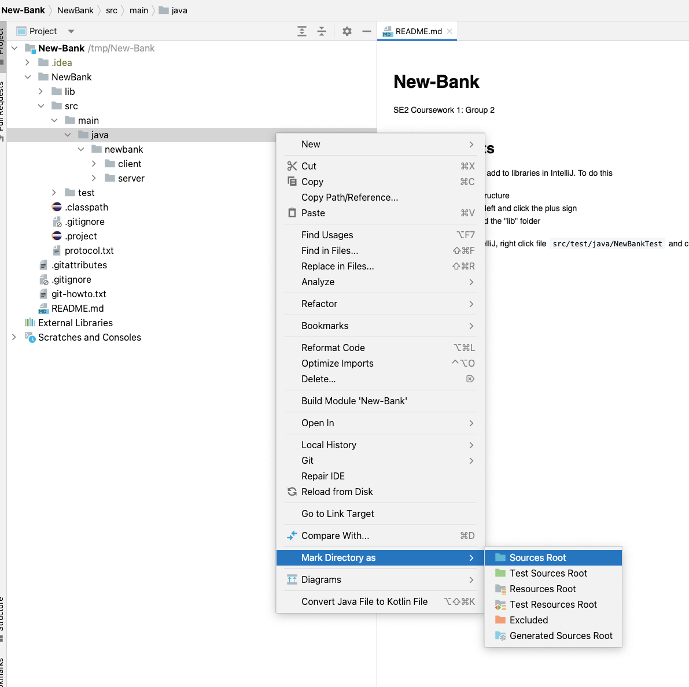
   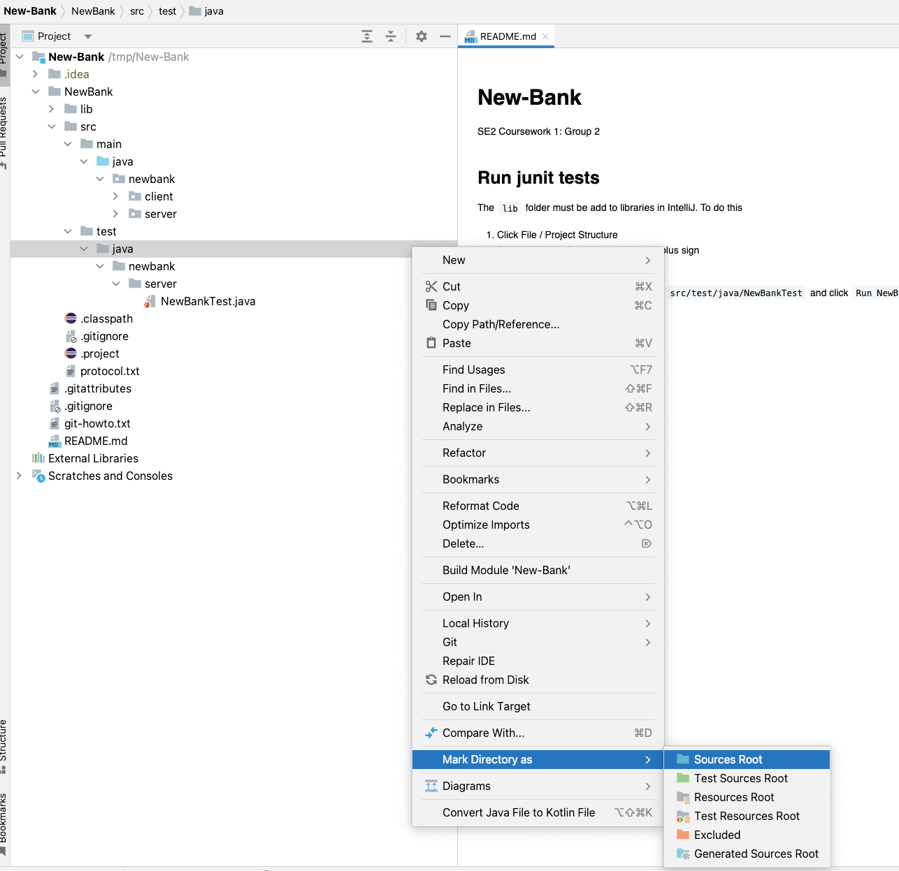
2.  The `lib` folder must be add to libraries in IntelliJ. To do this
* Click File / Project Structure
* Select "Libraries" on left and click the plus sign
* Select "Java" and find the "lib" folder
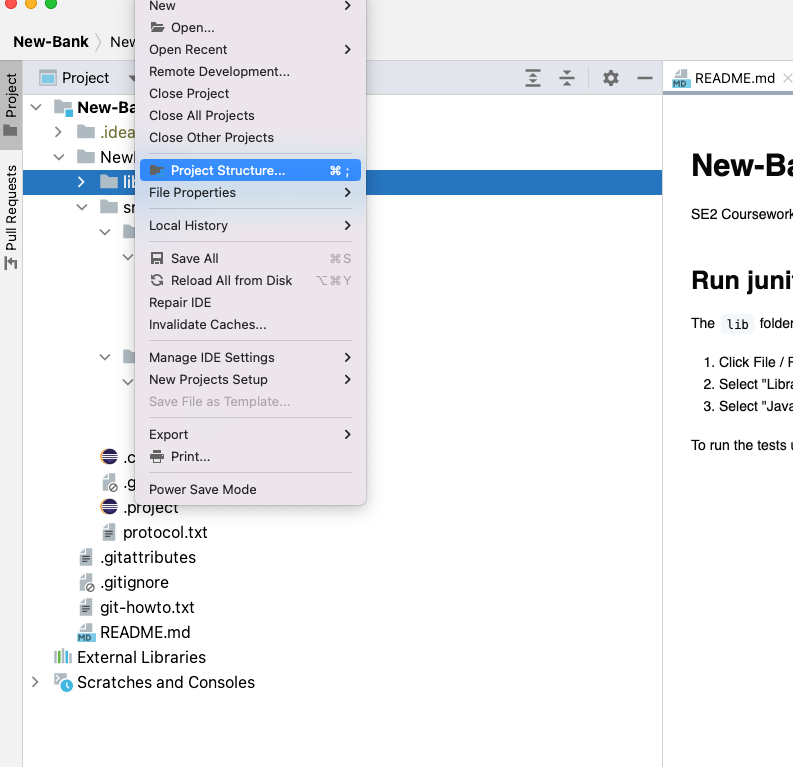
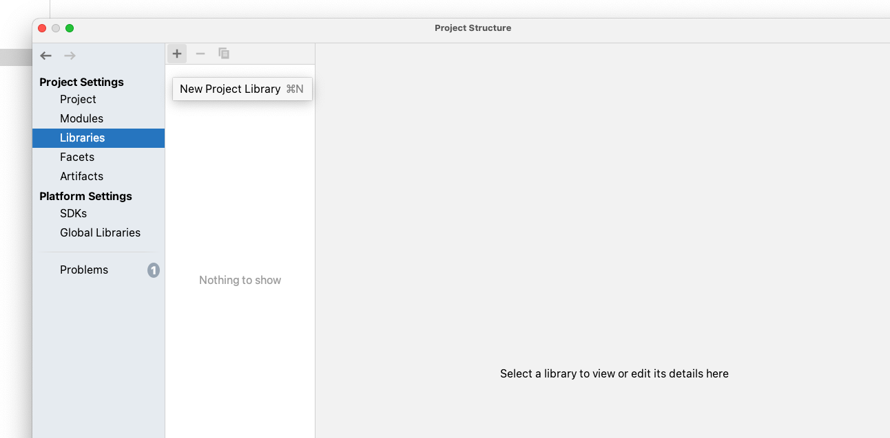
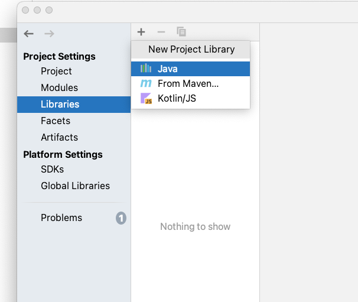
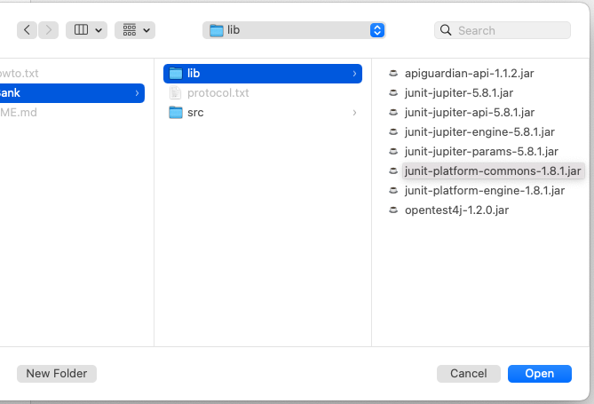
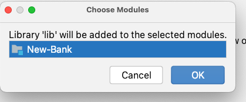
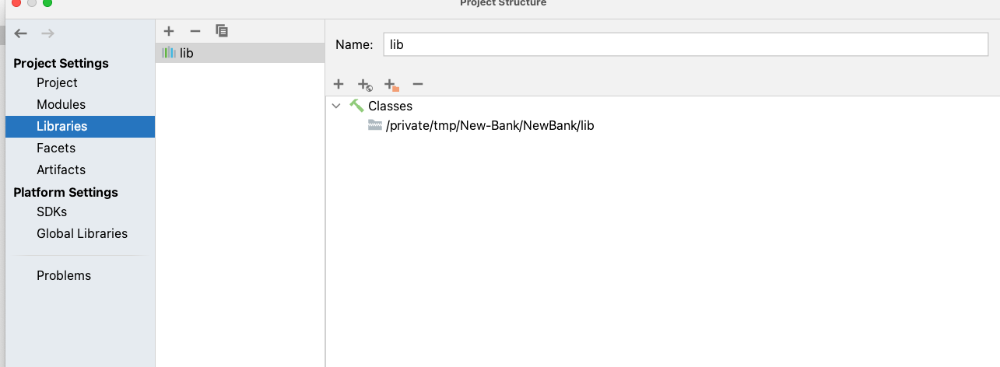

3. The compiler output path might need to be configured, this can be set to "/path/to/code/NewBank/build"
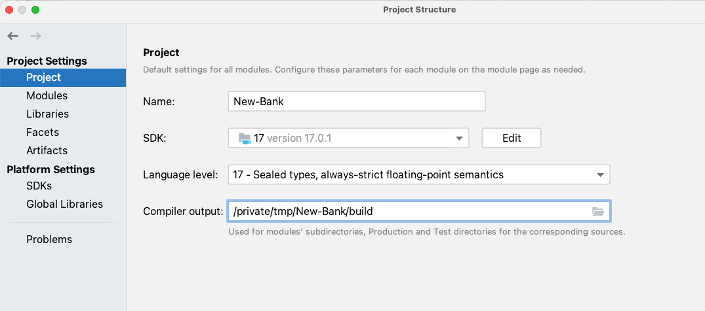
4. To run the tests using IntelliJ, right click file `src/test/java/NewBankTest` and click `Run NewBankTest`.
This will open new window at bottom and show the test result
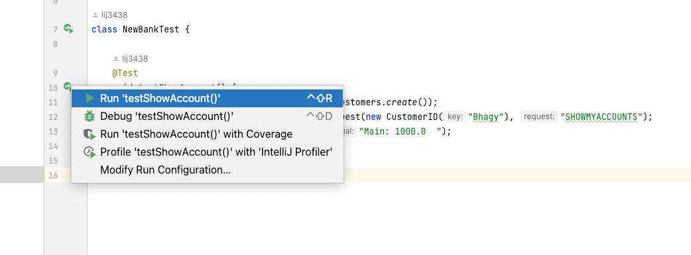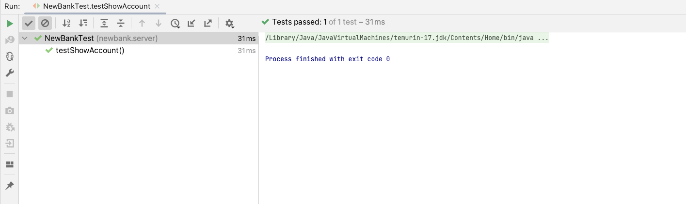
