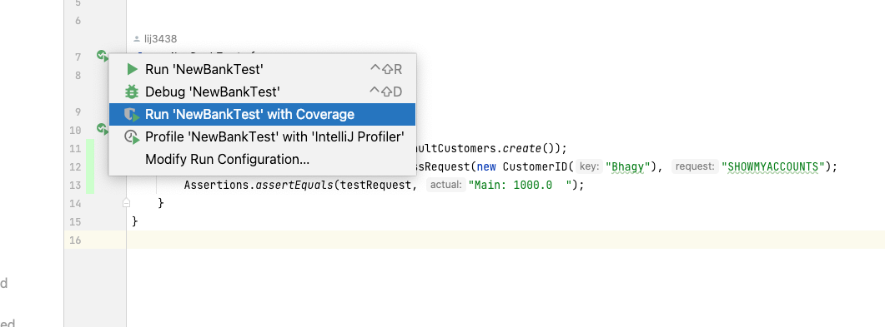
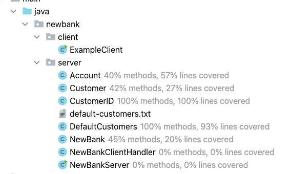
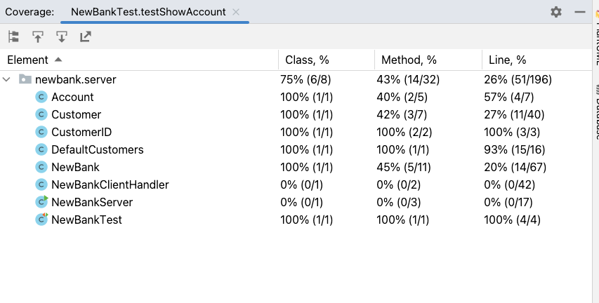

# New Bank Testing Plan

## Introduction
New Bank is dealing with customers money, it is very important the code works correctly.
If the code doesn't behave correctly then customers could lose money and cause some serious problems.
To make sure the code works, it is vital to test it.

New Bank is developed using Agile and there will be fast development with many changes. It is important
for developers to follow a testing plan and make sure code is well tested. 

## Exploratory Testing
Testing can be done manually by developers and this is an important step, known as exploratory testing.
Exploratory testing helps to understand at a basic level if the code works or not. It is also useful
for developers to learn about the user experience and find ways to make it better. 

Exploratory testing has some problems as well, it is manual and easy to miss some steps in the testing process.
It is also time consuming to manually check every change when developing. It is important to have automated
tests as well as exploratory testing.

**Team Guidance** - make sure to do some manual exploratory testing every feature you develop

## Unit Testing
Unit tests help developers verify the code behaves as expected. Unit tests are run by developers when coding using the IDE
and automatically using software like Jenkins. In Java, `junit` is the most common library for writing unit tests. Unit tests should only take a few seconds to run. It is good practice to run the unit tests frequently when developing. It is also very common to run the unit tests automatically when a pull request is created. A unit test should only test a single class. For example, `NewBank` has a `NewBankTest` class which only has tests for the methods in that class

**Team Guidance** Make sure to write some tests for every feature

## End to End testing
Unit tests are for testing classes, End to End (E2E) tests verify the whole system works together. E2E tests are similar to unit tests and often use `junit` as well. Instead of testing a single class, the E2E test will try behaving like a user would, running the new bank server and client then sending some commands to make sure it is working. E2E tests are often slower and take longer to develop compared to unit tests.

**Team Guidance** make sure the system has some E2E tests 

## Test coverage
It is important to know how well code is tested. Code coverage tools can measure what % of the code is tested. In the IDE there is an option to "Run code with coverage" to see this report. Google recommend 75% of lines of code as a good code coverage https://testing.googleblog.com/2020/08/code-coverage-best-practices.html

**Team Guidance** check code coverage in IDE using "Run with Coverage" and aim for 75% coverage

These screenshots show how to view coverage in IntelliJ IDE;

